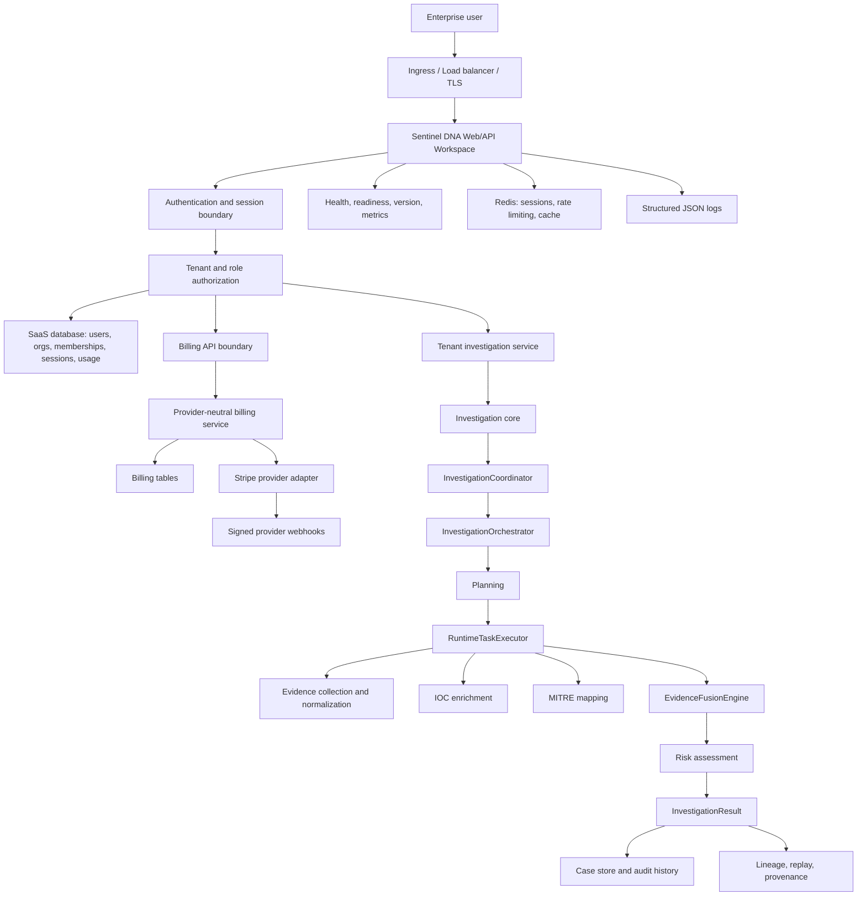
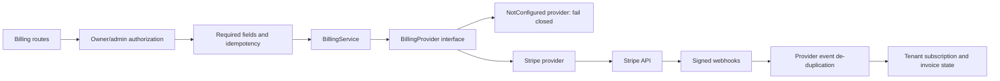
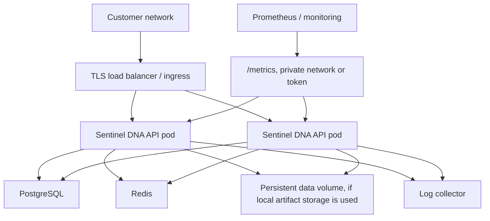

# Sentinel DNA Enterprise Beta Architecture Overview

## System Overview

Sentinel DNA is an AI-native security investigation platform. It converts alerts into evidence-backed decisions through deterministic collection, enrichment, mapping, fusion, risk scoring, recommendations, reporting, and audit records.

## Complete Architecture Diagram



## SaaS Boundary

The SaaS boundary wraps the investigation core without changing its public contract.

Responsibilities:

- User registration and login.
- Session token issuance and revocation.
- Organization creation.
- Tenant membership and role checks.
- Usage metering.
- Tenant-scoped API access.
- Billing API authorization.
- Operational health and metrics endpoints.

Request pattern:

```text
HTTP request
-> bearer token authentication
-> active tenant context
-> membership check
-> role check
-> tenant-scoped service call
```

## Billing Boundary

Billing is provider neutral. The internal billing model does not depend on Stripe-specific data structures.



Billing principles:

- Missing provider configuration never creates fake payment success.
- Idempotency keys are required for mutation flows.
- Tenant IDs scope customer, subscription, invoice, and provider event records.
- Webhooks are verified before processing.

## Investigation Core

The investigation core is the stable public engine:

```text
InvestigationCoordinator
-> InvestigationOrchestrator
-> Planning
-> RuntimeTaskExecutor
-> Evidence / Intelligence / MITRE / Fusion / Risk / Reasoning
-> InvestigationResult
```

Core outputs:

- Evidence-backed findings.
- Extracted indicators.
- IOC enrichment.
- Entity correlation.
- MITRE ATT&CK mapping.
- Fused evidence verdict.
- Risk score and factors.
- Confidence signal.
- Analyst recommendations.
- Report.
- Audit trail and replay records.

## Deployment Architecture

Recommended enterprise beta deployment:



Deployment controls:

- Docker image runs as non-root.
- Kubernetes deployment uses read-only root filesystem.
- Privilege escalation is disabled.
- Secrets are injected through Kubernetes Secret or equivalent.
- Readiness and liveness probes are configured.
- NetworkPolicy is included.
- Redis-backed rate limiting supports multi-instance deployments.

## Data Stores

| Store | Purpose |
| --- | --- |
| SaaS database | Users, organizations, memberships, sessions, usage, billing state. |
| Case store | Investigation case records and analyst action history. |
| Evidence store | Normalized evidence records. |
| Lineage store | Provenance, replay, and investigation traceability. |
| Redis | Distributed sessions, cache, and rate limiting. |

## Operations Boundary

Operations endpoints:

- `/healthz`
- `/readyz`
- `/version`
- `/metrics`

Operational outputs:

- JSON logs.
- Prometheus text metrics.
- Health/readiness status.
- Audit and usage events.

## Architecture Conclusion

Sentinel DNA's private beta architecture keeps customer-facing SaaS and operations concerns at the boundary while preserving a stable investigation core. This separation supports enterprise beta validation without redesigning the core investigation engine.
